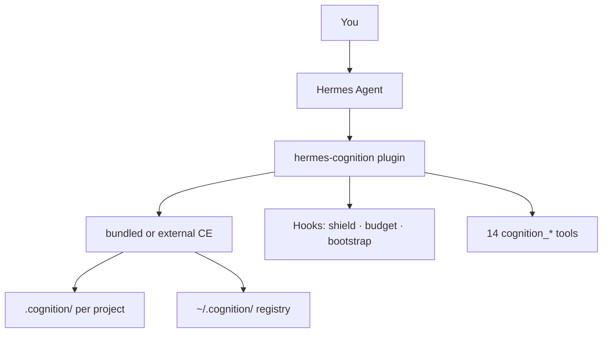

<p align="center">
  
</p>

<p align="center">
  
</p>

<h1 align="center">CogniCore</h1>

<p align="center">
  <strong>Turn Hermes Agent into a development orchestrator</strong><br/>
  Persistent project memory · Hallucination shield · Budget control · Graphify navigation
</p>

<p align="center">
  <a href="https://hermes-agent.nousresearch.com/docs/user-guide/features/plugins"></a>
  <a href="https://www.python.org/"></a>
  <a href="LICENSE"></a>
</p>

<p align="center">
  <a href="docs/USER_GUIDE.md"><b>User Guide</b></a> ·
  <a href="docs/TESTING.md"><b>Testing</b></a> ·
  <a href="docs/INTEGRATION.md"><b>Integration</b></a> ·
  <a href="Features.txt"><b>54 Features</b></a> ·
  <a href="https://github.com/Apar-Baral/CognitionEngine"><b>Cognition Engine</b></a>
</p>

<p align="center">
  Built by <a href="https://github.com/Apar-Baral"><b>Apar Baral</b></a>
</p>

---

## What is CogniCore?

**CogniCore** is a [Hermes Agent](https://github.com/NousResearch/hermes-agent) plugin that connects Hermes to the **[Cognition Engine](https://github.com/Apar-Baral/CognitionEngine)** library. Hermes keeps doing the work (chat, files, terminal, gateway). CogniCore adds:

- **Project DNA** — phases, sub-tasks, architecture graph across sessions  
- **Shield** — block or fix bad imports before writes land on disk  
- **Budget zones** — GREEN → YELLOW → RED → wrap-up at 90%  
- **Bootstrap** — structured “where you left off” context each turn  
- **Graphify** — project graph + token-smart file navigation  
- **Planning & multi-agent** — phased roadmaps and role-based delegation  

<p align="center">
  
</p>

---

## How it works



| Layer | Repo | Role |
|-------|------|------|
| Agent | [Hermes Agent](https://github.com/NousResearch/hermes-agent) | LLM loop, tools, gateway |
| Plugin | **CogniCore** (this repo) | Hooks, tools, CLI, Graphify |
| Engine | Bundled in plugin **or** [CognitionEngine](https://github.com/Apar-Baral/CognitionEngine) (optional) | DNA, shield, budget, planning |

**No external CE required** — CogniCore ships a bundled engine. See [docs/COGNITION_ENGINE.md](docs/COGNITION_ENGINE.md).

---

## Quick start

### 1. Prerequisites

- [Hermes Agent](https://hermes-agent.nousresearch.com/docs/getting-started/quickstart) installed  
- [Cognition Engine](https://github.com/Apar-Baral/CognitionEngine) — **optional** (bundled engine included)

### 2. Install (Linux / Kali / WSL)

```bash
git clone https://github.com/Apar-Baral/CogniCore.git
cd CogniCore
# Optional full engine:
# git clone https://github.com/Apar-Baral/CognitionEngine.git
# export COGNITION_ENGINE_PATH="$HOME/CognitionEngine/packages/cognition-engine"
bash scripts/install-hermes-cognition.sh
export PATH="$HOME/.hermes/hermes-agent/venv/bin:$PATH"
hermes-cognition doctor
hermes plugins list
```

**Git SSH error on clone?** Use [scripts/clone-repos-https.sh](scripts/clone-repos-https.sh) or see [Troubleshooting](#troubleshooting).

### 3. Windows

```powershell
git clone https://github.com/Apar-Baral/CogniCore.git
git clone https://github.com/Apar-Baral/CognitionEngine.git
cd CogniCore
$env:COGNITION_ENGINE_PATH = "$HOME\CognitionEngine\packages\cognition-engine"
.\scripts\install-hermes-cognition.ps1
hermes-cognition doctor
```

### 4. Use on a project

```bash
cd your-app-repo
hermes-cognition init
hermes-cognition plan "Build my application with tests and docs"
hermes-cognition graphify index
hermes -t terminal,file,web
```

Inside Hermes: `/cognition status`, `/cognition plan <goal>`, `/cognition end`.

---

## Documentation

| Guide | What you learn |
|-------|----------------|
| **[docs/USER_GUIDE.md](docs/USER_GUIDE.md)** | **How to use every feature** — CLI, tools, hooks, clusters A–I, Graphify |
| **[docs/TESTING.md](docs/TESTING.md)** | **Test checklist** — verify install and all clusters |
| **[docs/COGNITION_ENGINE.md](docs/COGNITION_ENGINE.md)** | **Bundled vs external** engine, roadmap, optional CE |
| **[docs/INTEGRATION.md](docs/INTEGRATION.md)** | Config, architecture, troubleshooting |
| **[docs/SOCIAL_PREVIEW.md](docs/SOCIAL_PREVIEW.md)** | GitHub / social preview image setup |
| **[Features.txt](Features.txt)** | Full 54-feature specification |
| **[config/cognition.example.yaml](config/cognition.example.yaml)** | Copy into `~/.hermes/config.yaml` |

---

## Feature summary

| Cluster | Count | Highlights |
|---------|-------|------------|
| **A** Memory | 1–6, 19–23, 28 | DNA, phases, avoid registry, bootstrap |
| **B** Shield | 7–12 | Import validation, auto-correct |
| **C** Budget | 13–18 | Zones, 90% handoff, efficiency |
| **D** Planning | 24–28 | Auto phases, impact analysis |
| **E** Viz | 29–34 | Progress maps, dashboards |
| **F** Learning | 35–41 | Session insights, RL optimizer |
| **G** Transfer | 42–45 | Cross-project registry |
| **H** Multi-agent | 46–49 | Roles + `cognition_delegate` |
| **I** Models | 50–54 | Model recommendations |
| **Graphify** | — | Graph index + navigate |

**Shipped in plugin:** 14 tools · 8 hooks · `hermes-cognition` CLI · Graphify

---

## CLI cheat sheet

| Command | Purpose |
|---------|---------|
| `hermes-cognition doctor` | Health check |
| `hermes-cognition init` | Create `.cognition/` |
| `hermes-cognition plan "<goal>"` | Phase roadmap |
| `hermes-cognition start` / `end` | Session lifecycle |
| `hermes-cognition status` | Progress |
| `hermes-cognition graphify index` | Build file graph |
| `hermes-cognition graphify navigate "<task>"` | Token-optimized file plan |

Use **`hermes-cognition`** if `hermes cognition` is not available. Run **`hermes`** (with file/terminal tools) to build code — not `hermes -t cognition` only.

---

## Repository layout

```
CogniCore/
├── README.md                      # Landing page (you are here)
├── Features.txt                   # 54-feature spec
├── docs/
│   ├── USER_GUIDE.md              # How to use all features
│   ├── TESTING.md                 # Test checklist
│   ├── INTEGRATION.md             # Technical integration
│   └── assets/                    # SVG diagrams
├── packages/hermes-cognition/     # Hermes plugin
├── scripts/                       # Install + clone helpers
└── config/cognition.example.yaml
```

---

## VMware / Kali guest

Full VM walkthrough (HTTPS git fix, install, project workflow): **[docs/USER_GUIDE.md § Install](docs/USER_GUIDE.md#1-install--enable)** and README sections in commit history for Kali.

```bash
curl -fsSL https://raw.githubusercontent.com/NousResearch/hermes-agent/main/scripts/install.sh | bash
# then CogniCore install script as above
```

---

## Troubleshooting

| Problem | Fix |
|---------|-----|
| `git@github.com: Permission denied` | `bash scripts/clone-repos-https.sh` or `git config --global --unset-all url.git@github.com:.insteadof` |
| `hermes-cognition` not found | Re-run install; `export PATH="$HOME/.hermes/hermes-agent/venv/bin:$PATH"` |
| Hermes YAML error | Fix `~/.hermes/config.yaml` — merge [config/cognition.example.yaml](config/cognition.example.yaml) manually |
| `plugins enable cognition` fails | Re-run install (registers `~/.hermes/plugins/cognition/`) |
| Agent cannot write files | Use `hermes` or `-t terminal,file,web`, not `-t cognition` only |
| No bootstrap | `init` + `start`; set `bootstrap.inject_on_session_start: true` |

---

## Related repos

| Repository | Description |
|------------|-------------|
| [CogniCore](https://github.com/Apar-Baral/CogniCore) | This plugin |
| [CognitionEngine](https://github.com/Apar-Baral/CognitionEngine) | Core Python library |
| [Hermes Agent](https://github.com/NousResearch/hermes-agent) | Upstream agent |

---

## Author

**Apar Baral** — [@Apar-Baral](https://github.com/Apar-Baral) · dedsecaparb@gmail.com  

Issues and contributions: [GitHub Issues](https://github.com/Apar-Baral/CogniCore/issues)
