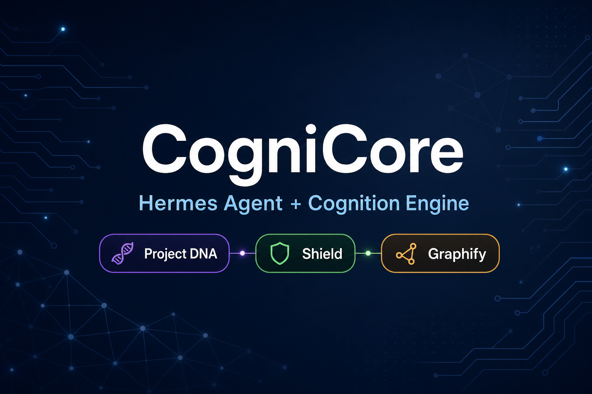
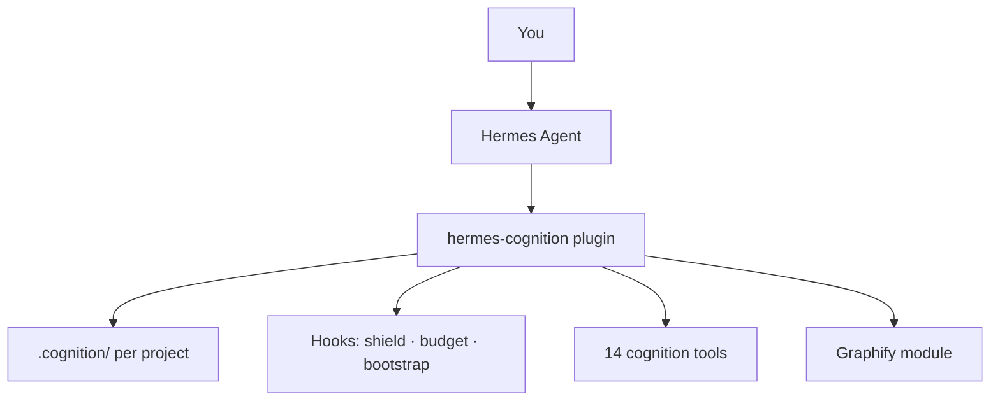

<p align="center">
  
</p>

<h1 align="center">CogniCore</h1>

<p align="center">
  <strong>Hermes Agent plugin — project memory, shield, budget, Graphify</strong><br/>
  Self-contained · No separate engine repo required
</p>

<p align="center">
  <a href="https://hermes-agent.nousresearch.com/docs/user-guide/features/plugins"></a>
  <a href="https://www.python.org/"></a>
  <a href="LICENSE"></a>
</p>

<p align="center">
  <a href="docs/USER_GUIDE.md"><b>User Guide</b></a> ·
  <a href="docs/PLUGIN.md"><b>What the Plugin Does</b></a> ·
  <a href="docs/FEATURE_MAP.md"><b>54 Features</b></a> ·
  <a href="docs/TESTING.md"><b>Testing</b></a>
</p>

<p align="center">
  Built by <a href="https://github.com/Apar-Baral"><b>Apar Baral</b></a>
</p>

---

## What is CogniCore?

**CogniCore** is a [Hermes Agent](https://github.com/NousResearch/hermes-agent) plugin (`hermes-cognition`). It turns Hermes into a **development orchestrator** with:

| Capability | What it does |
|------------|----------------|
| **Project DNA** | Phases, sub-tasks, goals — stored in `.cognition/` |
| **Shield** | Blocks suspicious imports before file writes |
| **Budget zones** | GREEN → YELLOW → RED → 90% wrap-up |
| **Bootstrap** | Injects mission context each session |
| **Graphify** | File graph + token-smart navigation |
| **Planning** | `plan` command generates phased roadmaps |
| **Multi-agent** | `cognition_delegate` with roles |

All logic ships **inside this repo** (`packages/hermes-cognition/`).  
**CognitionEngine** is a **separate project** — not bundled or required here.

---

## Feature map (54 capabilities)

**[Open the full feature table → docs/FEATURE_MAP.md](docs/FEATURE_MAP.md)**

<p align="center">
  <a href="docs/FEATURE_MAP.md">
    
  </a>
  <br/>
  <sub>Click diagram for feature table · SVG requires GitHub render — use FEATURE_MAP.md if image does not load</sub>
</p>

---

## Architecture



Details: **[docs/PLUGIN.md](docs/PLUGIN.md)**

---

## Quick install

### Linux / Kali

```bash
git clone https://github.com/Apar-Baral/CogniCore.git
cd CogniCore
bash scripts/install-hermes-cognition.sh
export PATH="$HOME/.hermes/hermes-agent/venv/bin:$PATH"
hermes-cognition doctor
```

### Windows

```powershell
git clone https://github.com/Apar-Baral/CogniCore.git
cd CogniCore
.\scripts\install-hermes-cognition.ps1
hermes-cognition doctor
```

Merge [config/cognition.example.yaml](config/cognition.example.yaml) into Hermes config if needed.

---

## How to use (daily workflow)

```bash
cd your-project
hermes-cognition init
hermes-cognition plan "Build my application"
hermes-cognition graphify index
hermes -t terminal,file,web
```

| Command | Purpose |
|---------|---------|
| `hermes-cognition doctor` | Health check |
| `hermes-cognition init` | Create `.cognition/` |
| `hermes-cognition plan "..."` | Phase roadmap |
| `hermes-cognition status` | Progress |
| `hermes-cognition graphify index` | Build file graph |
| `hermes` | Agent builds code (with file + terminal tools) |

**Important:** Use `hermes` or `hermes -t terminal,file,web` — **not** `hermes -t cognition` only.

Slash commands in chat: `/cognition status`, `/cognition plan …`, `/cognition end`

---

## Example: XSS scanner

Reference implementation with Phase 01 safety controls:

**[examples/xss-finder/](examples/xss-finder/)**

```bash
cd examples/xss-finder && pip install -e .
xss-finder scan 'https://testphp.vulnweb.com/search.php?test=1' --i-agree --allow-host testphp.vulnweb.com
```

---

## Documentation

| Doc | Content |
|-----|---------|
| [docs/PLUGIN.md](docs/PLUGIN.md) | **Detailed plugin behavior** (tools, hooks, data) |
| [docs/USER_GUIDE.md](docs/USER_GUIDE.md) | Step-by-step usage |
| [docs/FEATURE_MAP.md](docs/FEATURE_MAP.md) | All 54 features (table) |
| [docs/TESTING.md](docs/TESTING.md) | Test checklist |
| [docs/INTEGRATION.md](docs/INTEGRATION.md) | Config reference |
| [docs/SOCIAL_PREVIEW.md](docs/SOCIAL_PREVIEW.md) | GitHub social preview image |
| [docs/HERMES_TIPS.md](docs/HERMES_TIPS.md) | Avoid Hermes truncation errors |

---

## Troubleshooting

| Problem | Fix |
|---------|-----|
| `hermes-cognition` not found | `export PATH="$HOME/.hermes/hermes-agent/venv/bin:$PATH"` |
| Feature diagram not opening | Use [FEATURE_MAP.md](docs/FEATURE_MAP.md) (markdown table) |
| Agent cannot write files | Do not use `-t cognition` only |
| Hermes truncated writes | One file per turn — see [HERMES_TIPS.md](docs/HERMES_TIPS.md) |
| YAML config error | Fix `~/.hermes/config.yaml` indentation |

---

## Author

**Apar Baral** — [@Apar-Baral](https://github.com/Apar-Baral)

Issues: [GitHub Issues](https://github.com/Apar-Baral/CogniCore/issues)
